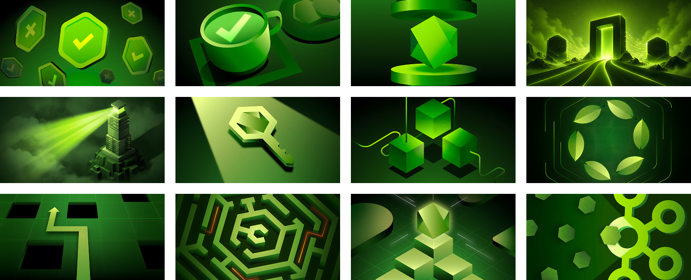

# DEVPAPER

<p></p>

Curated collection of ultra-high quality wallpapers carefully crafted for developers and tech enthusiasts. Featuring stunning visuals inspired by software development and the growing ecosystem around it.

## Node Wallpapers

<!-- START_NODE -->
<p></p>
<!-- CEASE_NODE -->

## Python Wallpapers

<!-- START_PYTHON -->
<p></p>
<!-- CEASE_PYTHON -->

## Change macOS Wallpaper

```sh
address="https://github.com/olankens/nodpaper/raw/HEAD/wallpapers/node-01.avif"
picture="$HOME/Pictures/Wallpapers/$(basename "$address")"
rm -v "$HOME/Library/Application Support/com.apple.wallpaper/Store/Index.plist"
killall WallpaperAgent
mkdir -p "$(dirname "$picture")"
curl -LA "mozilla/5.0" "$address" -o "$picture"
osascript -e "tell application \"System Events\" to tell every desktop to set picture to \"$picture\""
```
